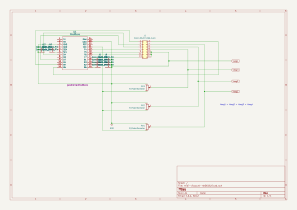

# MIDI Viscount RTE0616

MIDIfied Viscount 270 Pedalboard "RTE0616"

## Schematics



## Compile and flash

Compile using arduino-cli

```
cd firmware/firmware
make
make upload
```

## Unit tests

```
cd firmware
mkdir build; cd build
cmake ..
make
make test
```

## Configuration App

### Install dependencies

```
cd rte0616-config-app
npm install
```

### Web

```
cd rte0616-config-app
npm run build:web
npm run start:web
```

### Desktop (electron)

```
cd rte0616-config-app
npm run build:desktop
npm run start:desktop
```